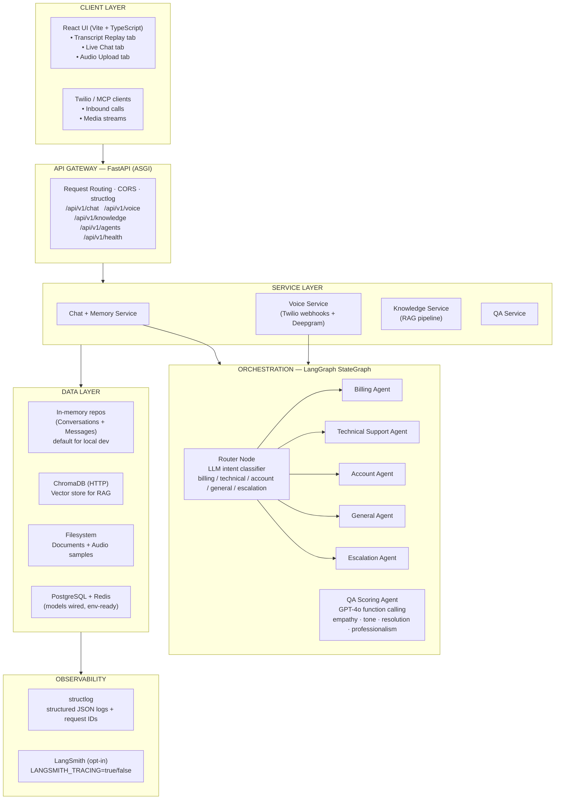

# ConversalQ — Enterprise AI Call Center Assistant

## Overall Architecture Plan

---

## 1. System Overview

ConversalQ is an enterprise-grade AI Call Center Assistant that orchestrates multiple specialized AI agents to automate customer support operations. The system uses multi-agent orchestration (LangGraph), RAG pipelines, conversational memory, voice AI, sentiment analysis, and intelligent escalation workflows.



---

## 2. Phase Plan

### Phase 1: Foundation — Basic Chatbot + FastAPI + OpenAI (Current)
**Objectives:**
- Set up project scaffolding with clean architecture
- Implement FastAPI with async endpoints
- Integrate OpenAI for basic chat completion
- Add streaming response support (SSE)
- Set up Docker development environment
- Implement basic conversation storage (PostgreSQL)
- Structured logging foundation

### Phase 2: RAG Integration + Vector Database
**Objectives:**
- Document ingestion pipeline (PDF, TXT, Markdown)
- Embedding generation with OpenAI embeddings
- ChromaDB vector store integration
- Chunking strategies (recursive, semantic)
- Semantic retrieval with similarity search
- Hybrid search (keyword + semantic)
- Citation-aware response generation
- Knowledge base management API

### Phase 3: Multi-Agent Orchestration
**Status: Complete**

**Implemented:**
- LangGraph `StateGraph` with `AgentState` TypedDict shared across all nodes
- Router node — LLM-based intent classification (billing / technical / account / general / escalation) with confidence scoring
- 5 specialist agent nodes built via a factory function (`_make_specialist_node`)
- Conditional edges: router → specialist based on intent; all specialists → END
- `get_compiled_graph()` cached with `@lru_cache` for process-lifetime reuse
- `AgentOrchestrationService` — orchestrates RAG prefetch + graph invocation + response extraction
- `ChatOpenAI` used for all LLM calls; `AsyncOpenAI` for embeddings
- SSE streaming via `astream_events(version="v2")`
- `AgentResponse` dataclass carries: content, intent, active_agent, confidence, rag_sources, should_escalate, escalation_reason, latency_ms
- `ChatResponse` schema enriched with agent metadata fields

### Phase 4: Memory + Session Handling
**Status: Complete**

**Implemented:**
- `ConversationMemoryService` — sliding-window context with LLM-powered rolling summarization
  - Configurable via settings: `MEMORY_WINDOW_SIZE` (default 6), `MEMORY_SUMMARIZE_THRESHOLD` (10), `MEMORY_SUMMARIZE_STEP` (4)
  - Short conversations (≤ threshold): all messages passed verbatim
  - Long conversations: last N messages verbatim + LLM summary of older turns
  - Summary stored on `conversation.summary`; re-generated every `SUMMARIZE_STEP` new messages
  - Summarization watermark tracked in `conversation.metadata_["summarized_through"]`
- `conversation_summary` field added to `AgentState` — injected into router prompt and all specialist system prompts
- Conversation status lifecycle: `active → escalated` auto-transition when `should_escalate=True`
- Manual status management via `PATCH /api/v1/chat/{id}/status` (active / resolved / escalated / closed)
- `update_summary()` + `update_status()` added to both `InMemoryConversationRepository` and `ConversationRepository`
- New endpoints:
  - `GET /api/v1/chat/{id}/history` — full chronological message list + status
  - `GET /api/v1/chat/{id}/summary` — LLM memory summary + turn count
  - `PATCH /api/v1/chat/{id}/status` — manual lifecycle transition

### Phase 5: Voice AI Integration
**What was built:**
- `POST /api/v1/voice/inbound` — Twilio webhook that creates a call session and returns a TwiML `<Gather>` greeting
- `POST /api/v1/voice/gather` — receives `SpeechResult` from Twilio (Twilio handles STT), routes through the full multi-agent graph, returns TwiML with the spoken reply
- `POST /api/v1/voice/status` — syncs Twilio call lifecycle events (completed, failed, etc.) to the call session and backing conversation
- `GET /api/v1/voice/sessions` — real-time monitoring of active calls with transcript logs
- `WS /api/v1/voice/stream/{call_sid}` — Twilio Media Stream WebSocket; pipes mulaw audio to Deepgram live STT for real-time transcript analytics
- `voice/call_session.py` — module-level `_sessions: Dict[str, CallSession]` store (same singleton pattern as in-memory repos)
- `voice/twiml_handler.py` — `TwiMLBuilder` generates welcome, agent reply, escalation, hangup, and error TwiML; `clean_for_speech()` strips markdown before text hits `<Say>`
- `voice/tts.py` — `TTSService` wraps OpenAI TTS; opt-in via `TTS_ENABLED=true` (default is Twilio's free `<Say voice="alice">`)
- `voice/stt.py` — `STTService` wraps Deepgram for pre-recorded and live transcription; gracefully degrades when `DEEPGRAM_API_KEY` is unset
- `VoiceService` re-uses `ChatService.process_message()` — every voice call is backed by a full ConversalQ conversation, so sliding-window memory, LLM summarization, and history/summary endpoints all work on voice calls too
- Webhook signature validation (HMAC-SHA1 via `twilio.request_validator`) is configurable: off for local dev, on for production via `TWILIO_VALIDATE_WEBHOOKS=true`
- New `.env` settings: `TWILIO_ACCOUNT_SID`, `TWILIO_AUTH_TOKEN`, `TWILIO_PHONE_NUMBER`, `TWILIO_WEBHOOK_BASE_URL`, `TWILIO_ESCALATION_NUMBER`, `DEEPGRAM_API_KEY`, `TTS_ENABLED`, `TTS_MODEL`, `TTS_VOICE`, `VOICE_LANGUAGE`, `VOICE_GREETING`, `VOICE_TIMEOUT`
- New packages: `twilio==9.4.3`, `deepgram-sdk==3.7.7`

### Phase 5 — Extended: QA Scoring Agent
**Status: Complete**

**Implemented:**
- `agents/qa_scorer.py` — `QualityScoringAgent` uses GPT-4o with **function calling** (structured outputs) to score a completed conversation across four dimensions:
  - **Empathy** — did the agent acknowledge the customer's feelings?
  - **Tone** — professional, calm, and helpful throughout?
  - **Resolution** — was the customer's issue actually resolved?
  - **Professionalism** — proper greeting/closing, policy adherence?
- Each dimension returns `{ score: 0–100, reasoning: "..." }` via Pydantic-enforced JSON schema
- Overall score = weighted average of all four dimensions
- Graceful fallback to neutral scores (50) if OpenAI call fails
- `services/qa_service.py` — `QAService` retrieves the conversation history, calls `QualityScoringAgent`, and records latency
- `schemas/qa.py` — `QAScoreRequest`, `QAScoreResponse`, `DimensionScore` Pydantic models
- `POST /api/v1/chat/{id}/qa-score` — on-demand endpoint; optional `notes` field for supervisor context
- **Frontend** — QA Score panel in Transcript Replay tab: color-coded dimension bars (emerald ≥86%, sky ≥70%, amber ≥50%, rose <50%), per-dimension LLM reasoning, re-run button, latency display

### Phase 5 — Extended: Audio File Upload (Deepgram Pre-recorded)
**Status: Complete**

**Implemented:**
- `voice/stt.py` — new `STTService.transcribe_audio_file(audio_bytes, mimetype)` method using Deepgram's asyncrest pre-recorded API; no `encoding`/`sample_rate` needed (container format auto-detected)
- `POST /api/v1/voice/upload` — multipart file upload endpoint:
  - Validates MIME type against 14 accepted audio types (WAV, MP3, MP4, OGG, WEBM, FLAC, AAC, video/webm)
  - Enforces 25 MB maximum file size (HTTP 413)
  - Returns `AudioTranscriptionResponse` with `transcript`, `confidence`, `duration_seconds`, `words[]` (word-level timestamps), `filename`, `content_type`, `stt_available`
  - When `DEEPGRAM_API_KEY` is unset, returns empty transcript with `stt_available: false` instead of raising
- `schemas/voice.py` — new `WordTimestamp` and `AudioTranscriptionResponse` schemas
- **Frontend** — dedicated **Audio Upload** tab with drag-and-drop zone, upload progress state, transcript result panel with confidence/duration header and collapsible word timestamp chips
- `data/sample_audio/` — two speech WAV files generated with Windows TTS for local testing:
  - `sample_call_billing.wav` — duplicate charge → refund scenario
  - `sample_call_technical.wav` — password reset / login issue scenario

### Phase 5 — Extended: LangSmith Tracing
**Status: Complete**

**Implemented:**
- `config.py` — four new settings: `langsmith_tracing` (bool), `langsmith_api_key`, `langsmith_project` (default `conversalq`), `langsmith_endpoint`
- `main.py` lifespan — sets `LANGCHAIN_TRACING_V2`, `LANGCHAIN_API_KEY`, `LANGCHAIN_PROJECT`, `LANGCHAIN_ENDPOINT` in `os.environ` at startup; explicitly sets `LANGCHAIN_TRACING_V2=false` when disabled
- `requirements.txt` — added `langsmith==0.3.45`
- `.env` — `LANGSMITH_TRACING=false` with placeholder key (flip to `true` + real key to enable)
- When enabled: every LangGraph invocation, every LLM call, and every RAG retrieval is automatically traced to the LangSmith project with full input/output payloads, token counts, and latency

### Phase 5 — Extended: MCP Server Declaration
**Status: Complete**

**Implemented:**
- `mcp.yaml` (project root) — declarative Model Context Protocol server configuration:
  - Transport: HTTP, `base_url` configurable via `CONVERSALQ_BASE_URL` env var
  - **7 tools**: `send_message`, `get_conversation_history`, `get_conversation_summary`, `update_conversation_status`, `score_conversation_quality`, `replay_transcript`, `search_knowledge_base`, `ingest_document`, `get_knowledge_base_stats`
  - **2 resources**: `sample_transcripts` (file-based), `openapi_spec` (live)
  - **2 prompts**: `evaluate_call`, `knowledge_qa`
  - Shared component schema: `DimensionScore`
- Enables AI agents and IDE tools (Copilot, Cursor) to call ConversalQ endpoints as first-class MCP tools

### Phase 6: Observability + Analytics
**Objectives:**
- OpenTelemetry instrumentation
- Prometheus metrics collection
- Grafana dashboard setup
- Structured logging with correlation IDs
- Agent performance analytics
- Latency monitoring per agent
- Error tracking and alerting
- Conversation analytics dashboard

### Phase 7: Enterprise Security + RBAC
**Objectives:**
- JWT authentication with refresh tokens
- Role-based access control (Admin, Supervisor, Agent, API)
- API key management
- PII masking in logs and storage
- Audit trail logging
- Rate limiting per role/endpoint
- Secrets management (Vault-ready)
- Input sanitization and validation

### Phase 8: Cloud Deployment + Scaling
**Objectives:**
- Kubernetes manifests (Helm charts)
- CI/CD with GitHub Actions
- Multi-environment configuration
- Auto-scaling policies
- Health check endpoints
- Blue-green deployment support
- Cloud provider deployment guides
- Load testing and benchmarking

---

## 3. Folder Structure

```
ConversalQ/
├── docs/
│   └── ARCHITECTURE.md
├── backend/
│   ├── app/
│   │   ├── main.py                 # FastAPI entry point; sets LangSmith env vars in lifespan
│   │   ├── config.py               # Pydantic Settings (OpenAI, Deepgram, Twilio, LangSmith…)
│   │   ├── dependencies.py         # FastAPI Depends() providers
│   │   │
│   │   ├── api/v1/
│   │   │   ├── router.py           # Aggregates all v1 sub-routers
│   │   │   ├── chat.py             # Chat · replay · history · summary · qa-score · status
│   │   │   ├── voice.py            # Twilio webhooks · audio upload · speak · sessions · WS stream
│   │   │   ├── knowledge.py        # Document ingest / search / list / delete
│   │   │   ├── agents.py           # Agent graph introspection
│   │   │   └── health.py           # Liveness probe
│   │   │
│   │   ├── api/middleware/
│   │   │   ├── error_handler.py    # Global domain exception → HTTP status mapping
│   │   │   ├── rate_limit.py       # Sliding-window rate limiter (per-IP, in-memory, 60 req/min)
│   │   │   └── request_id.py       # X-Request-ID injection
│   │   │
│   │   ├── guardrails/
│   │   │   ├── prompt_injection.py # Heuristic pattern scan — 8 categories, sync, <1ms
│   │   │   └── content_moderator.py # OpenAI omni-moderation-latest, async, opt-in
│   │   │
│   │   ├── agents/
│   │   │   ├── graph.py            # LangGraph StateGraph compilation (@lru_cache)
│   │   │   ├── state.py            # AgentState TypedDict + add_messages reducer
│   │   │   ├── router.py           # Intent classification node (LLM + confidence scoring)
│   │   │   ├── specialists.py      # 5 specialist nodes via factory (_make_specialist_node)
│   │   │   ├── orchestration.py    # AgentOrchestrationService (RAG prefetch + graph invoke)
│   │   │   └── qa_scorer.py        # QualityScoringAgent (GPT-4o function calling, 4-dim)
│   │   │
│   │   ├── guardrails/
│   │   │   ├── prompt_injection.py # Heuristic pattern scan — 8 categories, sync, zero latency
│   │   │   └── content_moderator.py # OpenAI omni-moderation-latest, async, opt-in
│   │   │
│   │   ├── services/
│   │   │   ├── chat_service.py      # Message processing, memory injection, status lifecycle
│   │   │   ├── memory_service.py    # Sliding-window context + LLM rolling summarization
│   │   │   ├── knowledge_service.py # RAG pipeline orchestration
│   │   │   ├── voice_service.py     # Twilio call session → agent graph → TwiML
│   │   │   ├── qa_service.py        # QA scoring orchestration
│   │   │   └── llm_service.py       # Direct LLM wrapper (legacy)
│   │   │
│   │   ├── repositories/
│   │   │   ├── base.py              # Abstract repository interface
│   │   │   ├── conversation_repo.py # SQLAlchemy-backed conversation repo
│   │   │   ├── message_repo.py      # SQLAlchemy-backed message repo
│   │   │   └── in_memory.py         # In-memory repos (default, no DB required)
│   │   │
│   │   ├── models/
│   │   │   ├── base.py              # SQLAlchemy declarative base
│   │   │   ├── conversation.py      # Conversation ORM model
│   │   │   └── message.py           # Message ORM model
│   │   │
│   │   ├── schemas/
│   │   │   ├── chat.py              # ChatRequest/Response, ConversationSummaryResponse
│   │   │   ├── voice.py             # Twilio webhook docs + AudioTranscriptionResponse
│   │   │   ├── qa.py                # QAScoreRequest/Response, DimensionScore
│   │   │   ├── knowledge.py         # Ingest/search/stats schemas
│   │   │   └── common.py            # Shared base types
│   │   │
│   │   ├── rag/
│   │   │   ├── ingestion.py         # PDF / TXT / Markdown loader
│   │   │   ├── chunking.py          # Recursive token-accurate chunker (tiktoken)
│   │   │   ├── embeddings.py        # OpenAI embeddings + SHA-256 in-process cache
│   │   │   ├── retriever.py         # Semantic similarity retrieval
│   │   │   └── vector_store.py      # ChromaDB HTTP client wrapper
│   │   │
│   │   ├── voice/
│   │   │   ├── call_session.py      # Module-level CallSid → CallSession in-memory store
│   │   │   ├── twiml_handler.py     # TwiMLBuilder + clean_for_speech() markdown sanitizer
│   │   │   ├── stt.py               # Deepgram: transcribe_url / transcribe_bytes / transcribe_audio_file
│   │   │   └── tts.py               # OpenAI TTS (opt-in; default is Twilio <Say>)
│   │   │
│   │   ├── core/
│   │   │   ├── exceptions.py        # Custom exception hierarchy
│   │   │   └── events.py            # Application lifecycle event hooks
│   │   │
│   │   ├── observability/
│   │   │   └── logging.py           # structlog configuration (JSON + request IDs)
│   │   │
│   │   └── db/
│   │       ├── session.py           # Async SQLAlchemy session factory
│   │       └── migrations/          # Alembic migrations
│   │
│   ├── requirements.txt
│   ├── Dockerfile
│   └── .env.example
│
├── frontend/
│   ├── src/
│   │   ├── App.tsx                 # 3-tab shell: Transcript Replay / Live Chat / Audio Upload
│   │   ├── api/client.ts           # Typed fetch wrappers for all backend endpoints
│   │   ├── types/index.ts          # Shared TypeScript interfaces
│   │   └── components/
│   │       ├── TranscriptInput.tsx # JSON transcript file picker
│   │       ├── ReplayResults.tsx   # Per-turn breakdown + summary + QA score panel
│   │       ├── QAScorePanel.tsx    # 4-dimension score bars with LLM reasoning
│   │       ├── AudioUpload.tsx     # Drag-and-drop audio upload → Deepgram transcript
│   │       ├── LiveChat.tsx        # Real-time chat
│   │       ├── TurnCard.tsx        # Single replay turn card
│   │       ├── SummaryPanel.tsx    # LLM memory summary display
│   │       ├── MetadataPanel.tsx   # Call metadata display
│   │       ├── StatusControls.tsx  # Conversation status transition buttons
│   │       ├── ConfidenceBar.tsx   # Confidence score visualisation
│   │       ├── IntentBadge.tsx     # Intent label badge
│   │       └── ChatMessage.tsx     # Chat bubble component
│   ├── vite.config.ts              # Dev proxy: /api → http://localhost:8000
│   └── package.json
│
├── data/
│   ├── sample_transcripts/         # 15 annotated call JSON files (CALL_001–015)
│   └── sample_audio/               # WAV files for audio upload testing
│       ├── sample_call_billing.wav     # Duplicate charge → refund (Windows TTS)
│       ├── sample_call_technical.wav   # Password reset / login issue (Windows TTS)
│       └── test_tone_440hz.wav         # Silent tone (pipeline smoke test)
│
├── infra/
│   ├── docker-compose.yml
│   └── docker-compose.dev.yml
│
├── mcp.yaml                        # MCP server declaration (7 tools, 2 resources, 2 prompts)
├── .env.example
├── .gitignore
├── Makefile
└── README.md
```

---

## 4. Key Architecture Decisions

### 4.1 Clean Architecture / Hexagonal Architecture
- **API Layer** → HTTP concerns only (request parsing, response formatting)
- **Service Layer** → Business logic orchestration
- **Repository Layer** → Data access abstraction
- **Model Layer** → Domain entities
- **Schema Layer** → API contracts (Pydantic)

### 4.2 Dependency Injection
All services injected via FastAPI `Depends()`. No global state. Enables testing with mocks.

### 4.3 Async-First
All I/O-bound operations use `async/await`. SQLAlchemy async sessions, httpx for HTTP calls, async OpenAI client.

### 4.4 LangGraph for Orchestration
Chosen over CrewAI for:
- Explicit state machine control
- Conditional routing between agents
- Better debuggability
- Native tool calling support
- Production-grade error handling

### 4.5 In-Memory First, DB-Ready
Local dev runs entirely against `InMemoryConversationRepository` and `InMemoryMessageRepository` — no PostgreSQL or Redis required. The SQLAlchemy models and async session factory are wired and ready; swapping to the DB-backed repos is a one-line change in `dependencies.py`.

### 4.6 API Versioning
`/api/v1/` prefix for all endpoints. Allows non-breaking evolution.

---

## 5. Data Models

The ORM models that exist today (`backend/app/models/`):

```sql
-- conversations  (conversation.py)
CREATE TABLE conversations (
    id          UUID PRIMARY KEY DEFAULT gen_random_uuid(),
    channel     VARCHAR(20) NOT NULL DEFAULT 'chat',  -- chat | voice | api
    status      VARCHAR(20) NOT NULL DEFAULT 'active', -- active | resolved | escalated | closed
    summary     TEXT,                                  -- LLM-generated rolling summary
    created_at  TIMESTAMPTZ DEFAULT NOW(),
    updated_at  TIMESTAMPTZ DEFAULT NOW(),
    metadata    JSONB DEFAULT '{}'
);

-- messages  (message.py)
CREATE TABLE messages (
    id               UUID PRIMARY KEY DEFAULT gen_random_uuid(),
    conversation_id  UUID REFERENCES conversations(id) ON DELETE CASCADE,
    role             VARCHAR(20) NOT NULL,  -- user | assistant | system
    content          TEXT NOT NULL,
    agent_name       VARCHAR(100),
    confidence_score FLOAT,
    latency_ms       INTEGER,
    created_at       TIMESTAMPTZ DEFAULT NOW(),
    metadata         JSONB DEFAULT '{}'
);
```

> In local development the system runs entirely against **in-memory repositories** (`repositories/in_memory.py`) — no PostgreSQL or Redis required. The SQLAlchemy models and `db/session.py` are wired and ready for production use.

---

## 6. Interview Talking Points (Per Phase)

### Phase 1
- "I designed a clean architecture with clear separation between API, service, and data layers"
- "I implemented async-first patterns with FastAPI and SQLAlchemy for high concurrency"
- "I used SSE streaming for real-time chat responses to reduce perceived latency"
- "I containerized from day one with Docker Compose for reproducible environments"
- "I implemented structured logging with structlog and correlation IDs for request tracing"

### Phase 2
- "I built a full RAG pipeline: PDF/DOCX/TXT ingestion, token-accurate chunking with tiktoken, OpenAI embeddings with SHA-256 in-process cache, and ChromaDB vector store"
- "I used chromadb-client (HTTP-only) to avoid native C++ build-tool dependencies in the dev environment"
- "Citation-aware retrieval formats source references directly into agent context blocks"
- "The knowledge base API is fully CRUD: ingest, search, list, delete, reset"

### Phase 3
- "I replaced the monolithic LLM call with a LangGraph state machine: router node classifies intent, conditional edges route to one of 5 specialist agents"
- "The router uses LLM-based confidence scoring — below 0.45 it auto-escalates rather than guessing"
- "All agents share a single AgentState TypedDict; the add_messages reducer handles message history merging"
- "RAG context is prefetched before graph execution so every specialist sees the same retrieved chunks without redundant embedding calls"
- "The compiled graph is cached with @lru_cache so LangGraph compilation cost is paid once at startup"

### Phase 4
- "I implemented a sliding-window memory system: the last 6 messages are passed verbatim; older turns are compressed into a rolling LLM-generated summary stored on the conversation record"
- "Summarization is lazy and incremental — it only re-runs when the old window has grown by 4+ messages, keeping token costs low"
- "The summary is injected into both the router (for accurate re-routing in long sessions) and specialist agents (for conversational continuity)"
- "Conversation status transitions automatically — active → escalated when the escalation agent fires; agents or operators can also manually resolve/close via PATCH endpoint"

### Phase 5 — Voice AI
- "I designed a two-path voice architecture: the primary Gather path uses Twilio's built-in STT (zero extra cost, just text in the webhook) and the secondary WebSocket path streams mulaw audio to Deepgram for real-time transcript analytics"
- "Every voice call is backed by a full ConversalQ conversation — the same sliding-window memory, LLM summarization, and history/summary endpoints that work for chat also work for phone calls with no extra code"
- "TwiML generation uses a builder pattern with a `clean_for_speech()` sanitizer that strips markdown before text hits `<Say>`, preventing Twilio from reading out asterisks and hash signs"
- "OpenAI TTS is opt-in via `TTS_ENABLED=true` — by default I use Twilio's free `<Say voice='alice'>` to keep latency low and avoid extra API calls in dev"
- "Webhook security uses HMAC-SHA1 signature validation via `twilio.request_validator`, toggled by `TWILIO_VALIDATE_WEBHOOKS` — off locally, on in production"
- "The call session store uses the same module-level singleton dictionary pattern as the in-memory conversation repos, so sessions persist for the process lifetime without a Redis dependency"
- "Escalation on voice mirrors the chat path — when `should_escalate=True` the service returns escalation TwiML that optionally dials a transfer number via `<Dial>`"

### Phase 5 Extended — QA Scoring
- "The QA Scoring Agent uses GPT-4o function calling with a strict JSON schema — this guarantees structured output without post-processing regex hacks, even if the model is verbose"
- "I chose four dimensions (empathy, tone, resolution, professionalism) because they map directly to real call center KPIs; supervisors can see not just the score but the LLM's reasoning for each dimension"
- "Scoring is on-demand, not automatic — the supervisor clicks 'Run QA Score' after a replay rather than running it on every turn, keeping API costs proportional to actual usage"
- "The fallback to neutral scores (50) means a failed OpenAI call doesn't break the supervisor's workflow — they see a soft warning rather than a 500 error"

### Phase 5 Extended — Audio File Upload
- "The audio upload endpoint accepts 14 MIME types and uses Deepgram's pre-recorded API with just buffer + mimetype — no encoding or sample-rate parameters needed because Deepgram auto-detects them from the container headers"
- "I separated `transcribe_bytes()` (for Twilio's raw mulaw stream) from `transcribe_audio_file()` (for container formats) because they require different PrerecordedOptions — passing encoding to a WAV file causes Deepgram to reject it"
- "Graceful degradation is a first-class design goal: every STT method returns an empty TranscriptionResult with `stt_available: false` rather than raising, so the endpoint is safe to demo even without a Deepgram key"
- "The frontend word timestamp chips use a `<details>` element so the panel stays compact for short files but lets you drill into timing data for longer calls"

### Phase 5 Extended — LangSmith + MCP
- "LangSmith tracing is configured entirely through env vars at startup — no decorators or instrumentation code in the agent graph itself, because LangChain/LangGraph auto-detects the `LANGCHAIN_TRACING_V2` flag"
- "I used `mcp.yaml` rather than a running MCP proxy because the declarative format is enough for IDE tools like Copilot and Cursor to discover and call the endpoints directly, without a sidecar process"
- "The MCP config maps all 9 REST endpoints as named tools with typed parameters, which means an AI agent using the MCP client can orchestrate ConversalQ end-to-end — send a message, score the conversation, search the knowledge base — all in one agentic workflow"

### Phase 6 — Guardrails
- "Guardrails are layered: the rate limiter is a Starlette middleware (outermost), prompt injection is a synchronous regex scan that runs in <1ms before every agent call, and content moderation is an async OpenAI API call that is opt-in because it adds ~100ms latency"
- "I chose heuristic pattern matching for injection detection rather than a second LLM call — it's deterministic, auditable, and has zero marginal cost; the 8 pattern categories cover the most common OWASP LLM Top 10 attack vectors"
- "The rate limiter uses a sliding window (deque of timestamps) rather than a fixed window to avoid the thundering herd problem at window boundaries — if the limit is 60/min, a burst of 60 requests at 00:59 and 60 more at 01:01 is still correctly throttled"
- "Content moderation uses OpenAI's `omni-moderation-latest` model and fails open: if the API call fails (network error, quota exceeded), the message is allowed through with a warning log rather than blocking the user — availability over perfect security for a call center context"
- "The three new exception types (`PromptInjectionError` → 400, `ContentModerationError` → 422, `RateLimitExceededError` → 429) are mapped in the existing `error_handler.py` table — no new middleware needed for error formatting"

---

## 7. Production Improvements Roadmap
- JWT authentication + RBAC (Phase 7)
- Circuit breaker for OpenAI / Twilio / Deepgram calls
- Swap in-memory repos for PostgreSQL-backed repos (one-line change in `dependencies.py`)
- Redis session cache for horizontal scaling
- OpenTelemetry + Prometheus + Grafana (Phase 6)
- CDN for frontend static assets
- Kubernetes manifests + GitHub Actions CI/CD (Phase 8)
- A/B testing framework for agent prompt optimisation
- Multi-tenancy support
- PII masking in logs and storage
- Data retention policies and GDPR compliance
